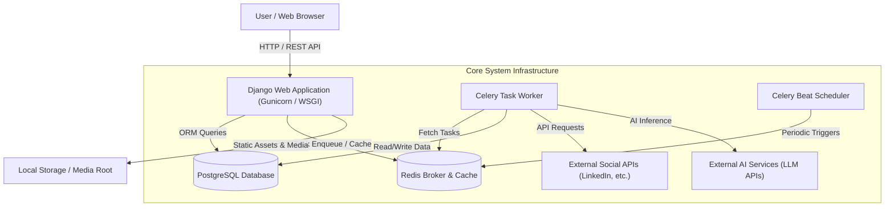
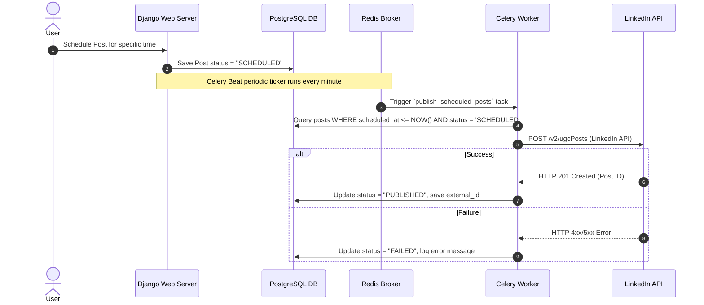

# Personal Brand OS — System Architecture Document

## 1. Executive Summary

**Personal Brand OS** is an all-in-one content management, AI assistance, analytics, and social media automation platform designed for professionals, founders, and content creators to systematically build, scale, and analyze their online brand presence across major social networks (e.g., LinkedIn, Twitter/X).

The system is built on a modular Django architecture, leveraging Celery and Redis for background processing and task scheduling, PostgreSQL for robust relational data management, and Django REST Framework alongside server-rendered Django templates for web interface interactions.

---

## 2. High-Level System Architecture



---

## 3. Technology Stack

| Layer | Technology | Description |
|---|---|---|
| **Language** | Python 3.11+ | Primary application language |
| **Web Framework** | Django 5.0+ | Core web framework, ORM, templating, session auth |
| **API Layer** | Django REST Framework (DRF) 3.15+ | RESTful APIs for client integration & dashboard endpoints |
| **Database** | PostgreSQL 16 / SQLite | Primary relational database (PostgreSQL in production, SQLite fallback in dev) |
| **Task Queue & Broker** | Celery 5.3+ / Redis 7+ | Asynchronous job execution and distributed task queuing |
| **Scheduler** | Celery Beat | Cron-style background job scheduling (e.g. content publishing, analytics sync) |
| **WSGI / Web Server** | Gunicorn / Django WSGI | Application server for serving HTTP requests |
| **Environment Management** | django-environ | Secure 12-factor application configuration management |
| **Media Processing**| Pillow | Asset resizing and image handling |

---

## 4. Modular Domain Applications (`apps/`)

The application codebase is structured into isolated domain modules under the `apps/` directory to promote clean separation of concerns:

```
apps/
├── accounts/          # Custom User model, Authentication, User Profiles & OAuth (LinkedIn)
├── brand/             # Brand identity, voice/tone definitions, messaging guidelines
├── content/           # Core post drafting, rich content creation, tag management
├── calendar/          # Editorial calendar visualization & post scheduling matrix
├── ai_agents/         # AI-powered post generator, tone optimizer, ideation engine
├── research/          # Market research, competitor analysis, content saving & bookmarking
├── news/              # News aggregation, RSS feeds, industry trend ingestion
├── social/            # Platform connections, OAuth tokens, social publisher & dispatcher
├── analytics/         # Engagement tracking, performance metrics, growth reports
├── projects/          # Campaign and goal management for content initiatives
├── media/             # Media asset library (images, graphics, documents)
├── notifications/     # System alerts, publication status, scheduled post reminders
└── dashboard/         # Aggregated metrics, overview widgets, and executive summary
```

### Module Responsibilities Breakdown

1. **`accounts`** ([apps/accounts](file:///d:/Repositories/personal-brand-os-/apps/accounts))
   - Extends `AbstractUser` to support custom profiles.
   - Manages user sessions, authentication credentials, and OAuth tokens (e.g., LinkedIn OAuth 2.0 flow).
2. **`brand`** ([apps/brand](file:///d:/Repositories/personal-brand-os-/apps/brand))
   - Stores user personal branding parameters: pillar topics, key target audience, brand mission, and writing guidelines.
3. **`content`** ([apps/content](file:///d:/Repositories/personal-brand-os-/apps/content))
   - Handles post creation, status lifecycles (`Draft` -> `In Review` -> `Scheduled` -> `Published` -> `Archived`), and taxonomy.
4. **`calendar`** ([apps/calendar](file:///d:/Repositories/personal-brand-os-/apps/calendar))
   - Visualizes scheduled content over time and enables timeline updates for planned releases.
5. **`ai_agents`** ([apps/ai_agents](file:///d:/Repositories/personal-brand-os-/apps/ai_agents))
   - Houses LLM prompt orchestrators to generate content drafts, rewrite posts according to brand voice, and brainstorm topics.
6. **`research` & `news`** ([apps/research](file:///d:/Repositories/personal-brand-os-/apps/research), [apps/news](file:///d:/Repositories/personal-brand-os-/apps/news))
   - Aggregates external feeds, trending news, and custom user notes to serve as input sources for new content.
7. **`social`** ([apps/social](file:///d:/Repositories/personal-brand-os-/apps/social))
   - Integrates with third-party social media APIs. Executes automated posting, token refresh cycles, and platform-specific API transformations.
8. **`analytics`** ([apps/analytics](file:///d:/Repositories/personal-brand-os-/apps/analytics))
   - Ingests performance metrics (impressions, reactions, comments, shares) and produces performance intelligence.
9. **`projects` & `media`** ([apps/projects](file:///d:/Repositories/personal-brand-os-/apps/projects), [apps/media](file:///d:/Repositories/personal-brand-os-/apps/media))
   - Organizes content into larger brand campaigns and manages uploads/attachments.
10. **`notifications`** ([apps/notifications](file:///d:/Repositories/personal-brand-os-/apps/notifications))
    - Dispatches alerts upon task execution, posting success/failure, or analytics triggers.

---

## 5. Execution & Data Flow Architecture

### 5.1 Request-Response Flow
1. User sends an HTTP request to the web application.
2. Django routes the request through security and middleware stack (Security, CORS, Session, CSRF, Auth).
3. `config/urls.py` delegates execution to the corresponding app view/API controller.
4. Django ORM fetches or mutates records in PostgreSQL.
5. HTML template or JSON response is returned to the client.

### 5.2 Asynchronous Content Publishing Flow


---

## 6. Infrastructure & Deployment Setup

The application is fully containerized using **Docker** and orchestrated via **Docker Compose**:

* **`web` Service**: Runs Django WSGI/Gunicorn application server listening on port `8000`.
* **`db` Service**: Runs PostgreSQL 16 Alpine container with persistent volume mounting (`postgres_data`).
* **`redis` Service**: Lightweight Redis 7 Alpine container acting as celery broker and result backend.
* **`worker` Service**: Asynchronous worker process running `celery -A config worker`.
* **`beat` Service**: Background task scheduler running `celery -A config beat`.

---

## 7. Security & Configuration Best Practices

- **12-Factor Configuration**: Environment settings stored in `.env` and loaded securely via `django-environ`.
- **Authentication**: Custom authentication backends with encrypted session support and OAuth 2.0 state verification.
- **API Security**: Django REST Framework permission classes (`IsAuthenticated`), CORS header controls, and CSRF token verification on state-changing methods.

---

## 8. Development & Testing Blueprint

- **Test Suite**: Automated testing configured using `pytest` and `pytest-django` ([pytest.ini](file:///d:/Repositories/personal-brand-os-/pytest.ini), [conftest.py](file:///d:/Repositories/personal-brand-os-/conftest.py)).
- **Database Migrations**: Standard Django migrations managed via `manage.py makemigrations` and `manage.py migrate`.
